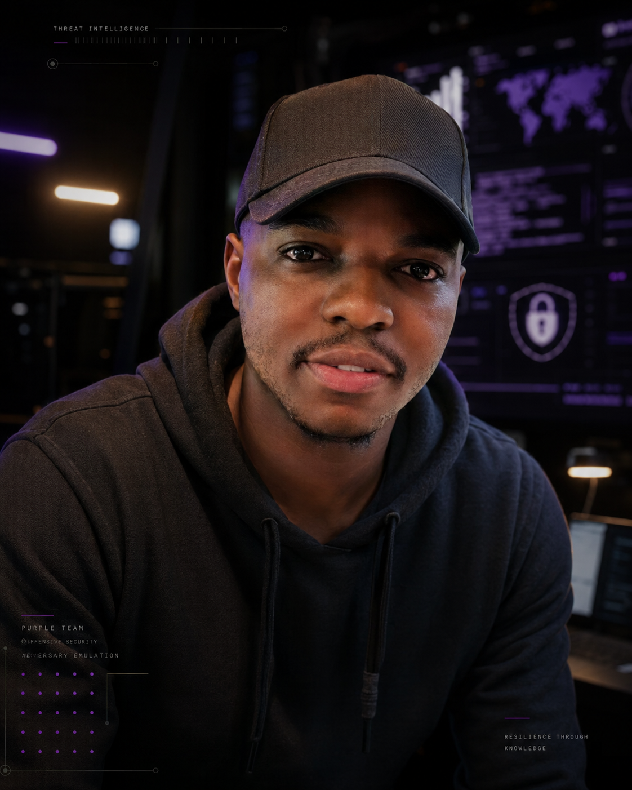

---
hide:
  - navigation
  - toc
  - footer
---

<section class="b13-page-hero">

B13 // OPERATOR PROFILE

<h1 class="b13-page-title">
Joseph <strong>Daniel</strong>
</h1>

Purple Team Security Engineer focused on adversary emulation,
detection engineering, incident response, security operations
and Azure cloud security.

PURPLE TEAM
DETECTION ENGINEERING
DFIR
THREAT HUNTING
AZURE SECURITY
SECURITY OPERATIONS

</section>

<section class="b13-page-section">

OPERATOR
<strong>JOSEPH DANIEL</strong>

ROLE
<strong>PURPLE TEAM SECURITY ENGINEER</strong>

PROFESSIONAL IDENTITY

<h2>
Engineering security across offense and defense.
</h2>

My work is centered on understanding how adversary behavior appears
inside real systems and using that understanding to improve defensive
visibility, investigation and resilience.

Rather than treating offensive testing, security monitoring and incident
response as separate activities, I approach them as a continuous
validation cycle:

ATTACK → OBSERVE → DETECT → INVESTIGATE → CONTAIN → HARDEN → RETEST

The objective is not simply to demonstrate that an attack technique
works. The objective is to determine whether it was visible, whether it
could be detected, whether it could be investigated and whether the
defensive improvement survives retesting.

</section>

<section class="b13-page-section">

IDENTITY MODEL

<h2>
Joseph Daniel & BELISARIUS13
</h2>

The professional identity and technical brand have different purposes,
but they represent the same body of work.

01 // PROFESSIONAL

<h3>
Joseph Daniel
</h3>

My public professional identity for cybersecurity engineering,
professional networking and career development.

PURPLE TEAM SECURITY ENGINEER

02 // TECHNICAL

<h3>
BELISARIUS13
</h3>

My technical security lab for documenting reproducible campaigns,
detections, investigations, cloud-security experiments and research.

PURPLE TEAM SECURITY LAB

03 // INSIGNIA

<h3>
B13
</h3>

The visual shorthand used across lab telemetry, campaign identifiers,
technical artwork and the BELISARIUS13 interface.

SECURITY LAB MARK

</section>

<section class="b13-page-section">

CORE PRACTICE

<h2>
Security engineering focus
</h2>

The portfolio is deliberately concentrated around capabilities that
support Purple Team engineering.

01

<h3>
Adversary Emulation
</h3>

Controlled ATT&CK-aligned activity used to test telemetry,
detections and security controls.

02

<h3>
Detection Engineering
</h3>

Turning observed behavior into testable detection hypotheses,
queries and validated defensive logic.

03

<h3>
Incident Response & DFIR
</h3>

Evidence collection, investigation, timeline reconstruction,
root-cause analysis and remediation validation.

04

<h3>
Threat Hunting
</h3>

Using endpoint, network and cloud telemetry to search for
behavior that may not yet generate an alert.

05

<h3>
Azure Security
</h3>

Identity, workload, posture, policy, logging and cloud-security
control validation.

06

<h3>
Security Automation
</h3>

Using scripting, version control and repeatable workflows to
improve security engineering efficiency.

</section>

<section class="b13-page-section">

WHY BELISARIUS

<h2>
Adapt. Observe. Reposition.
</h2>

The technical brand takes inspiration from strategic adaptability:
understanding the environment, adjusting to changing conditions and
using both offensive and defensive capability effectively.

B13

<h3>
A security lab built around adaptation
</h3>

BELISARIUS13 represents the idea that security engineering is not a
static configuration exercise. Attack techniques change, telemetry
changes, infrastructure changes and detections degrade over time.

The lab therefore emphasizes continuous validation: generate activity,
measure the defensive response, improve the environment and test again.

</section>

<section class="b13-page-section">

EXPLORE THE WORK

<h2>
The evidence is in the campaigns.
</h2>

The portfolio is designed so claims about technical capability are
supported by reproducible projects, detections and research.

<a href="projects/">
CAMPAIGNS <strong>→</strong>
</a>

<a href="lab/">
PURPLE TEAM LAB <strong>→</strong>
</a>

<a href="detections/">
DETECTION LIBRARY <strong>→</strong>
</a>

<a href="blog/">
SECURITY RESEARCH <strong>→</strong>
</a>

</section>

JOSEPH DANIEL // BELISARIUS13

<strong>
Offense informs defense. Detection drives improvement.
</strong>

