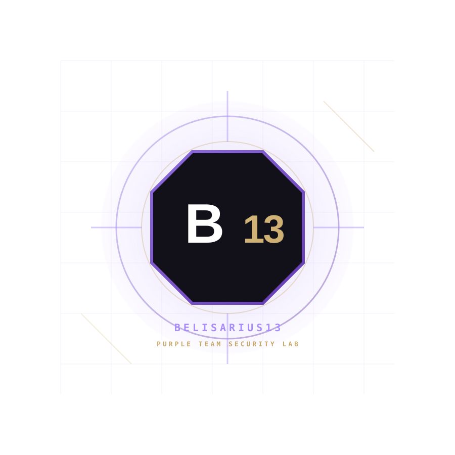

---
hide:
  - navigation
  - toc
---

<section class="b13-hero">

B13 // PURPLE TEAM SECURITY LAB

<h1 class="b13-name">
Joseph Daniel
</h1>

Purple Team Security Engineer

I build and validate defensive security capabilities through controlled
adversary activity, detection engineering, incident investigation and
cloud security research.

<a href="projects/" class="b13-button">
Explore Projects
</a>

<a href="lab/" class="b13-button b13-button-secondary">
Enter the Lab
</a>

  

BELISARIUS13

PURPLE TEAM SECURITY LAB

MODE
<strong>PURPLE TEAM</strong>

FOCUS
<strong>VALIDATION</strong>

TELEMETRY
<strong>ONLINE</strong>

CAMPAIGN
<strong>00 // ACTIVE</strong>

$ validate --controls

attack → detect → harden → retest

</section>

<section class="b13-section">

OPERATING MODEL

<h2 class="b13-section-heading">
Security through continuous validation.
</h2>

BELISARIUS13 is my technical security lab for studying how offensive
techniques interact with telemetry, detections, investigation workflows
and defensive controls.

ATTACK
→

OBSERVE
→

DETECT
→

INVESTIGATE
→

CONTAIN
→

HARDEN
→

RETEST

</section>

<section class="b13-section">

CORE DISCIPLINES

<h2 class="b13-section-heading">
Purple Team Engineering
</h2>

OFFENSIVE VALIDATION

<h3>Adversary Emulation</h3>

Controlled ATT&CK-aligned activity used to test telemetry,
detections and defensive controls.

DEFENSIVE ENGINEERING

<h3>Detection Engineering</h3>

Building, testing and tuning detections using endpoint,
network and cloud telemetry.

INVESTIGATION

<h3>Incident Response & DFIR</h3>

Timeline reconstruction, evidence collection, root-cause
analysis, containment and remediation.

CLOUD

<h3>Azure Security</h3>

Identity, workload, posture, logging and cloud control
validation across Microsoft Azure.

</section>

<section class="b13-section">

ACTIVE CAMPAIGN

<h2>
B13 // CAMPAIGN-00
</h2>

<h3>
Secure Purple Team Portfolio Platform
</h3>

Engineering the BELISARIUS13 platform using Git, GitHub Actions,
MkDocs, Cloudflare, secure DNS, HTTPS and reproducible
deployment practices.

STATUS // ACTIVE

</section>

<section class="b13-section">

THE LAB

<h2 class="b13-section-heading">
BELISARIUS13
</h2>

A reproducible cybersecurity research environment focused on
adversary emulation, detection engineering, threat hunting,
incident response, network forensics and cloud security.

<strong>Offense informs defense. Detection drives improvement.</strong>

</section>

